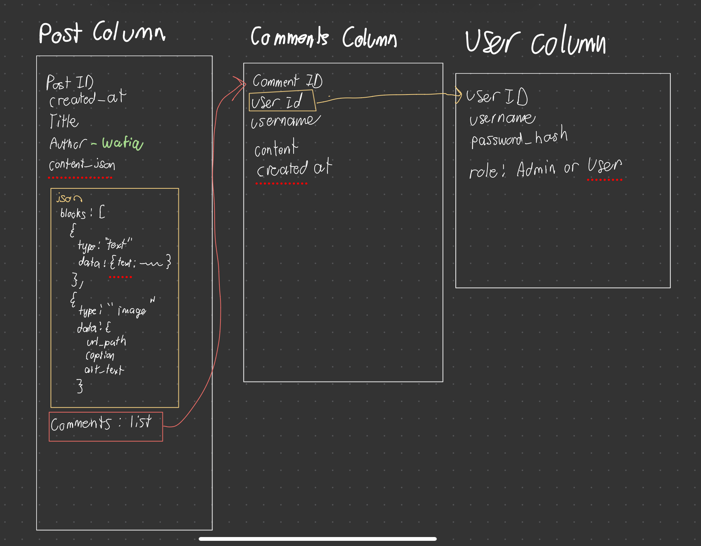

# Wafiqs_Blog
Repo for 1XD3 W26 Group project group #73 


## Architecture
### Client

### Server
Each file in the backend is a route that can be accessed via `/api/**/ROUTE.php` from the client

MySQL database


## Running the frontend
you should be able to get away with using live server

## Running the server:

If you have php installed
```bash
cd api
php -S localhost:8000 router.php
```

If you are using XAMMP then i have no idea lol. It's easier to just install php on your computer.