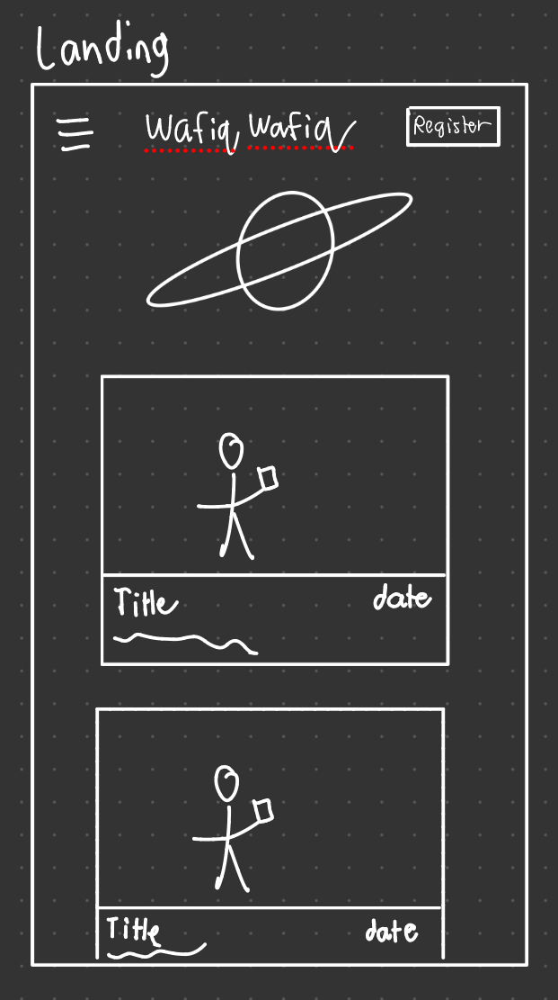
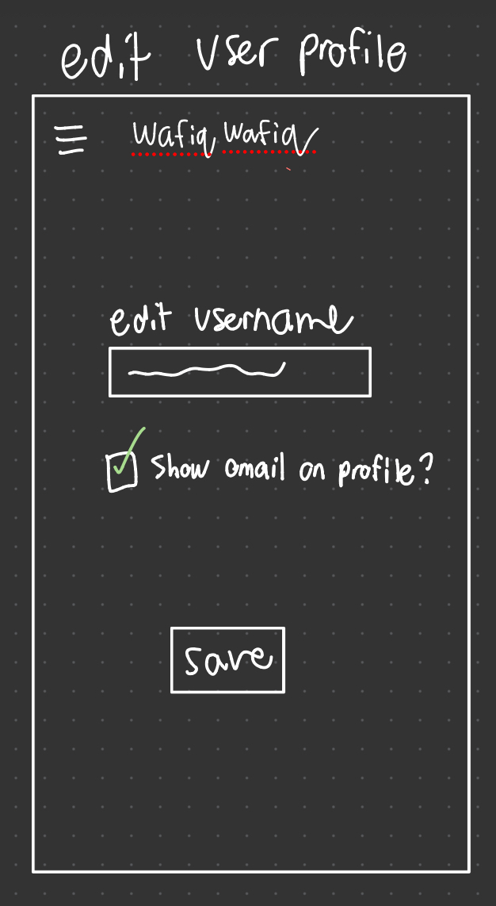
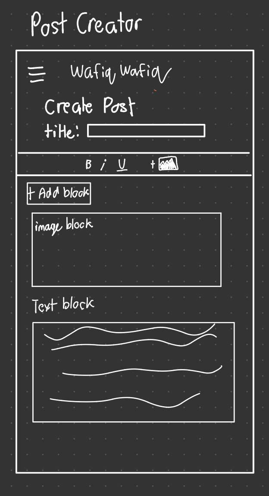
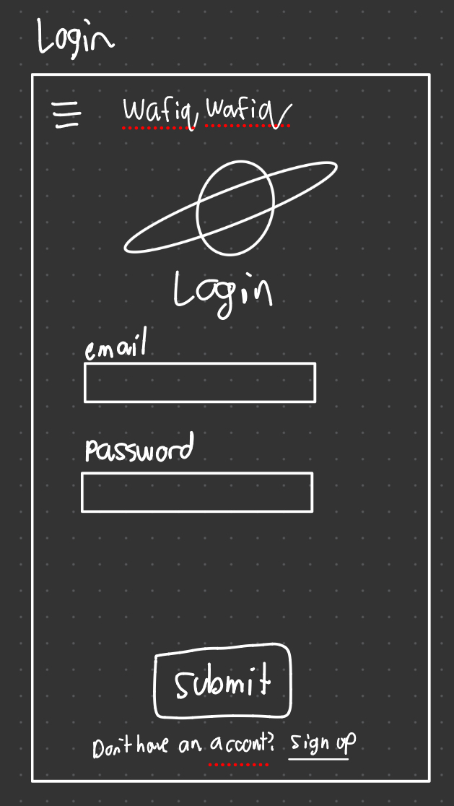
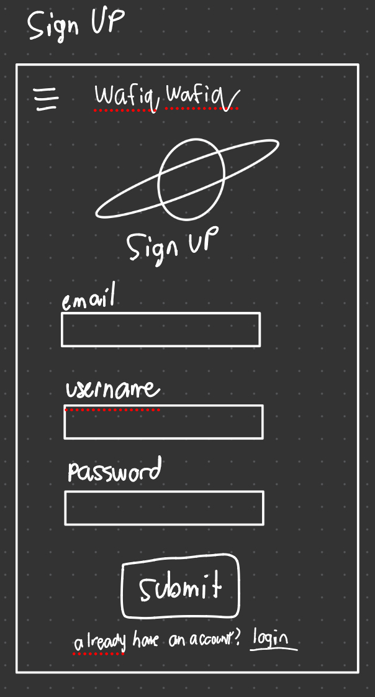
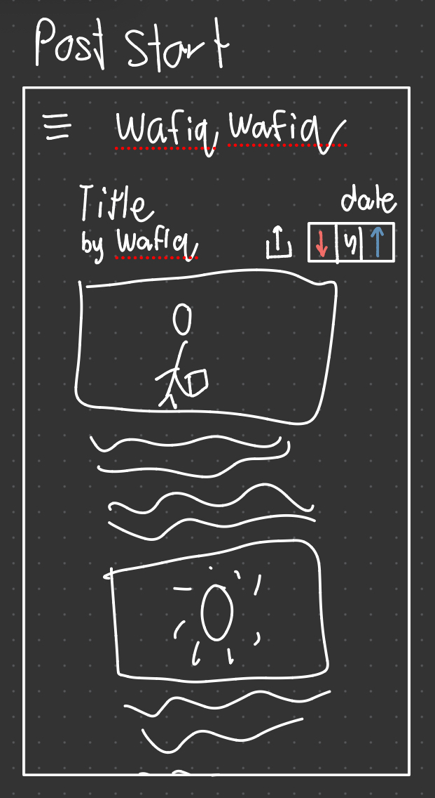
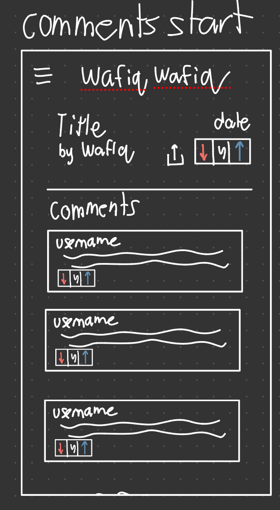

--made in obsidian

# Development Plan

## 0. Resubmission Revision Log

- [NEW] Added this revision log section so all updates are easy to find.
- [REVISED] Team roles were updated to match implemented work and remove work that is no longer required.
- [REVISED] The increments section now includes first-increment outcomes and what changed in the plan afterward.
- [REVISED] Client feedback section now includes direct client quotes, specific plan changes, and reasons for each change.

---

## 1. Names

**Team Name**: Steve Steve

**Client**: Wafiq Ahmad, Computer Science Student at McMaster University

**App Name**: Wafiq's Postulations

---

## 2. Purpose

Wafiq's Postulations is a blog platform designed for Wafiq Ahmad to share his thoughts and postulations with the world. The website is built for a mobile-first accessible format.

The platform will function similarly to social media sites like Instagram and Twitter, allowing users to:

- View a timeline of Wafiq's posts on the homepage
- Like or dislike posts
- Comment on posts to spark discussion
- Like or dislike comments
- View user profiles and interaction history

**Typical User Flow**

1. A user visits the homepage and sees a timeline of posts by Wafiq
2. The user can scroll through posts without logging in
3. To interact (like/comment), the user must register or log in
4. Logged-in users can:
   - Like/dislike posts
   - Comment on posts
   - Like/dislike comments
5. Wafiq (admin) can create and manage posts through a dashboard

---

## 3. Data Description

### Tables Required

| Table             | Purpose                           | Information Stored                                              |
| ----------------- | --------------------------------- | --------------------------------------------------------------- |
| **users**         | Store user account information    | User authentication and profile data                            |
| **posts**         | Store blog posts created by Wafiq | Post content, metadata, likes, and dislikes                     |
| **comments**      | Store user comments on posts      | Comment text, likes, dislikes, and association with users/posts |
| **post_votes**    | Track user votes on posts         | Which user liked/disliked which post                            |
| **comment_votes** | Track user votes on comments      | Which user liked/disliked which comment                         |

### Table Schemas

```sql
-- Stores user account information
CREATE TABLE
  IF NOT EXISTS users (
    `id` INT AUTO_INCREMENT PRIMARY KEY,
    `username` VARCHAR(50) UNIQUE NOT NULL,
    `password_hash` VARCHAR(255) NOT NULL,
    `email` VARCHAR(255) NULL,
    `show_email` BOOLEAN NOT NULL DEFAULT FALSE,
    `profile_picture` VARCHAR(255) NULL,
    `created_at` TIMESTAMP DEFAULT CURRENT_TIMESTAMP,
    `updated_at` TIMESTAMP DEFAULT CURRENT_TIMESTAMP ON UPDATE CURRENT_TIMESTAMP
  );

CREATE TABLE
  IF NOT EXISTS posts (
    `id` INT AUTO_INCREMENT PRIMARY KEY,
    `author_id` INT NOT NULL,
    `content` TEXT NOT NULL,
    `likes` INT NOT NULL DEFAULT 0,
    `dislikes` INT NOT NULL DEFAULT 0,
    `share_count` INT NOT NULL DEFAULT 0,
    `created_at` TIMESTAMP DEFAULT CURRENT_TIMESTAMP,
    `updated_at` TIMESTAMP DEFAULT CURRENT_TIMESTAMP ON UPDATE CURRENT_TIMESTAMP,
    `deleted_at` TIMESTAMP NULL,
    FOREIGN KEY (`author_id`) REFERENCES users (`id`)
  );

-- Tracks which users voted on which posts
CREATE TABLE
  IF NOT EXISTS post_votes (
    `id` INT AUTO_INCREMENT PRIMARY KEY,
    `post_id` INT NOT NULL,
    `user_id` INT NOT NULL,
    `vote_type` ENUM ('like', 'dislike') NOT NULL,
    `created_at` TIMESTAMP DEFAULT CURRENT_TIMESTAMP,
    FOREIGN KEY (`post_id`) REFERENCES posts (`id`),
    FOREIGN KEY (`user_id`) REFERENCES users (`id`),
    UNIQUE KEY `unique_user_post_vote` (`post_id`, `user_id`)
  );

-- Stores user comments on posts
CREATE TABLE
  IF NOT EXISTS comments (
    `id` INT AUTO_INCREMENT PRIMARY KEY,
    `post_id` INT NOT NULL,
    `user_id` INT NOT NULL,
    `content` TEXT NOT NULL,
    `likes` INT NOT NULL DEFAULT 0,
    `dislikes` INT NOT NULL DEFAULT 0,
    `created_at` TIMESTAMP DEFAULT CURRENT_TIMESTAMP,
    `updated_at` TIMESTAMP DEFAULT CURRENT_TIMESTAMP ON UPDATE CURRENT_TIMESTAMP,
    -- [REVISED] Added for soft delete support on comments
    `deleted_at` TIMESTAMP DEFAULT NULL,
    FOREIGN KEY (`post_id`) REFERENCES posts (`id`),
    FOREIGN KEY (`user_id`) REFERENCES users (`id`)
  );

-- Tracks which users voted on which comments
CREATE TABLE
  IF NOT EXISTS comment_votes (
    `id` INT AUTO_INCREMENT PRIMARY KEY,
    `comment_id` INT NOT NULL,
    `user_id` INT NOT NULL,
    `vote_type` ENUM ('like', 'dislike') NOT NULL,
    `created_at` TIMESTAMP DEFAULT CURRENT_TIMESTAMP,
    -- [REVISED] Added for soft delete support on comment vote records
    `deleted_at` TIMESTAMP DEFAULT NULL,
    FOREIGN KEY (`comment_id`) REFERENCES comments (`id`),
    FOREIGN KEY (`user_id`) REFERENCES users (`id`),
    UNIQUE KEY `unique_user_comment_vote` (`comment_id`, `user_id`)
  );
```

---

## 4. Functions Performed by the App

### User Functions

| Function                 | Description                                   | Database Effect                                                                         |
| ------------------------ | --------------------------------------------- | --------------------------------------------------------------------------------------- |
| **Register**             | Create a new user account                     | INSERT into `users`                                                                     |
| **Login**                | Authenticate user and create session          | SELECT from `users`                                                                     |
| **View Posts**           | Browse Wafiq's posts on homepage              | SELECT from `posts` (WHERE `deleted_at` IS NULL) _meaning he has not deleted the post._ |
| **View Profile**         | View a user's profile and interaction history | SELECT from `users`, `comments`                                                         |
| **Like/Dislike Post**    | Like or dislike a post                        | INSERT/UPDATE `post_votes`, UPDATE `posts` SET `likes`/`dislikes`                       |
| **Comment on Post**      | Add a comment to a post                       | INSERT into `comments`                                                                  |
| **Like/Dislike Comment** | Like or dislike a comment                     | INSERT/UPDATE `comment_votes`, UPDATE `comments` SET `likes`/`dislikes`                 |
| **Share Post**           | Share a post                                  | Frontend only (no DB effect)                                                            |
| **Update Profile**       | Edit profile information                      | UPDATE `users`                                                                          |
| **Logout**               | End user session                              | Session destruction (no DB effect)                                                      |

### Admin Functions (Wafiq Only)

| Function         | Description                      | Database Effect                 |
| ---------------- | -------------------------------- | ------------------------------- |
| **Create Post**  | Publish a new blog post          | INSERT into `posts`             |
| **Delete Post**  | Remove a post (soft delete)      | UPDATE `posts` SET `deleted_at` |
| **Manage Posts** | View all posts including deleted | SELECT from `posts`             |

### Client-Side Implementation

- **Mobile-First Responsive Design**: CSS media queries and flexible layouts using Bootstrap CSS
- **Accessibility (WCAG)**:
  - Alt text for all images
  - Large font sizes (minimum 16px base)
  - High contrast colors (celestial theme with accessible color combinations)
  - Keyboard navigation support
  - ARIA labels for interactive elements
- **JavaScript Functionality**:
  - AJAX for liking/disliking comments without page reload
  - Comments are refetched in an interval
  - Form validation
  - Session management

---

## 5. Roles of Team Members (Revised)

### Andy

- Implement backend API for creating and retrieving posts
- Develop frontend UI for displaying posts on homepage

### Shiva

- [REVISED] Implement post deletion (soft delete logic)
- [REVISED] Implement comment deletion (soft delete logic)
  - [REVISED] Admins can delete any comment, other users can delete their own comments
- [REVISED] Update UI to be consistent with comment deletion
- [REVISED] ~~Build admin interface for managing posts~~
  - Reason: A separate admin page was removed from the plan because role-based session checks already gate create/delete actions in the existing UI.

### Toheeb

- Implement authentication system (login/signup)
- Handle session management and user state
- Develop profile editing functionality

### Steve

- Implement comment system (CRUD operations)
- Develop UI for displaying comments
- Implement like/dislike functionality for comments

## 6. Wireframes

### Landing (Mobile View)



### Edit User Profile (Mobile View)



### Post Creator (Mobile View)



### Login (Mobile View)



### Signup (Mobile View)



### Post (Mobile View)



### Comments (Mobile View)



## 7. The Increments

### First Increment (Target: Week 6)

**Goal:** Deliver a functional app where users can view posts, create accounts, and comment.

**App Capabilities After This Increment:**

- Users can sign up and log in
- Users can view posts on the homepage
- Users can comment on posts
- Admin can delete posts

| Team Member | Functionality                    |
| ----------- | -------------------------------- |
| **Andy**    | Showing posts on the home screen |
| **Shiva**   | Deleting posts                   |
| **Toheeb**  | Login and signup                 |
| **Steve**   | Adding comments                  |

**[REVISED] First Increment Outcomes and Plan Adjustments**

- Delivered: login/signup, homepage post viewing, adding comments, and admin post deletion.
- [REVISED] Added comment deletion (role-based) to follow-up scope after seeing moderation needs during first-increment review.
- [REVISED] Removed dedicated admin dashboard from near-term scope and replaced it with role-aware controls in current pages.
- [REVISED] Kept soft-delete strategy as a core requirement after client confirmed recovery is important.

---

## 8. Client Feedback

**Feedback Collected After Presenting First Increment:**

The following quotes are from client discussions and the project client information notes.

> "I want a blog post to be able to share my interesting thoughts and realizations with the world. Users are more likely to be mobile, this would be something that you look at on the most convenient device (most likely a mobile phone)."

> "the website must follow basic accessibility standards from WCAG (alt text for images, large font sizes, high contrast colors)."

> "Wafiq wants us to focus on 'celestial' themed design."

> "I should be the only one able to make posts sharing my thoughts, others should be able to only comment, like, or dislike posts and comments."

**Requirements from Wafiq**

1. **Mobile-First Design**: The primary target is mobile users, so the interface must be optimized for mobile devices.

2. **Accessibility**: Must follow WCAG standards
3. **Celestial Theme**: Design should have a space theme

4. **Anonymous Mode**: users who are not logged in can view comments but cannot make comments

5. **Social Media-Like Interactions**: Users should be able to like/dislike posts and comments, comment, and view my posts.

6. **Permission based system**: I should be the only one able to make posts sharing my thoughts, others should be able to only comment, like, or dislike posts and comments.

**[REVISED] Changes Made to the Plan Based on This Feedback (Specific + Reasons):**

- [REVISED] Maintained and emphasized mobile-first implementation in layout and testing priorities.
  - Reason: Client explicitly said users are mostly mobile.
- [REVISED] Strengthened accessibility requirements in implementation notes (alt text, readable sizing, contrast, keyboard support).
  - Reason: Client explicitly requested WCAG-oriented accessibility.
- [REVISED] Preserved celestial visual direction as a non-optional design requirement.
  - Reason: Client requested thematic consistency with the concept of the blog.
- [REVISED] Enforced role-based authoring permissions: only Wafiq can create posts; authenticated users can comment and vote.
  - Reason: Client asked for owner-only posting and user interaction features.
- [REVISED] Continued soft delete for posts and added soft delete for comments in team responsibilities.
  - Reason: Supports moderation and recovery rather than irreversible deletion.
- [REVISED] Removed a separate admin dashboard from immediate scope.
  - Reason: Existing role-based session checks and conditional UI can satisfy admin controls with less implementation overhead.

**Finished Product Reaction:**

- Not yet collected at hand-in time. This section will be updated once the client has reviewed the final product end-to-end.
